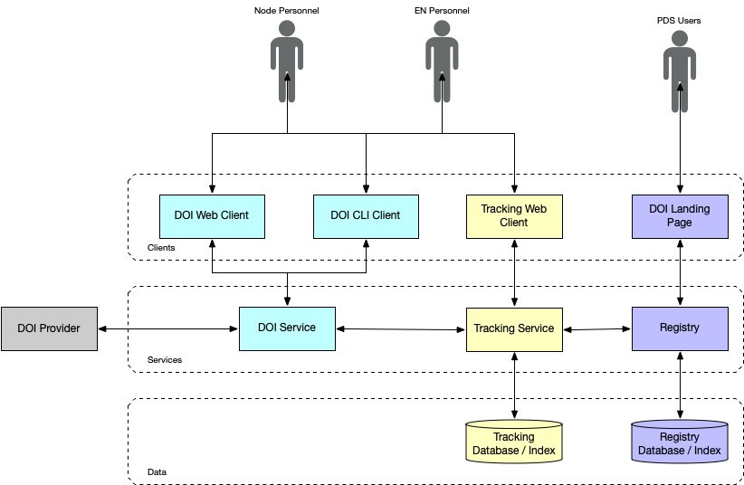
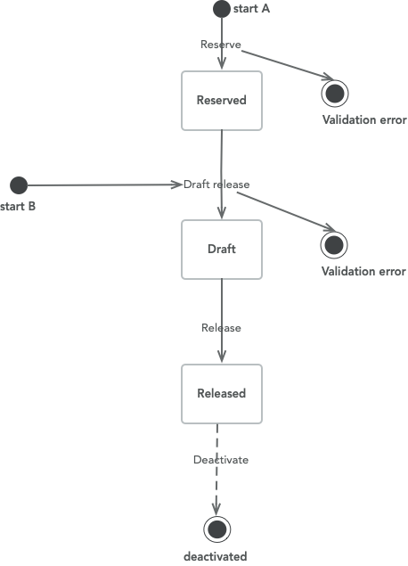
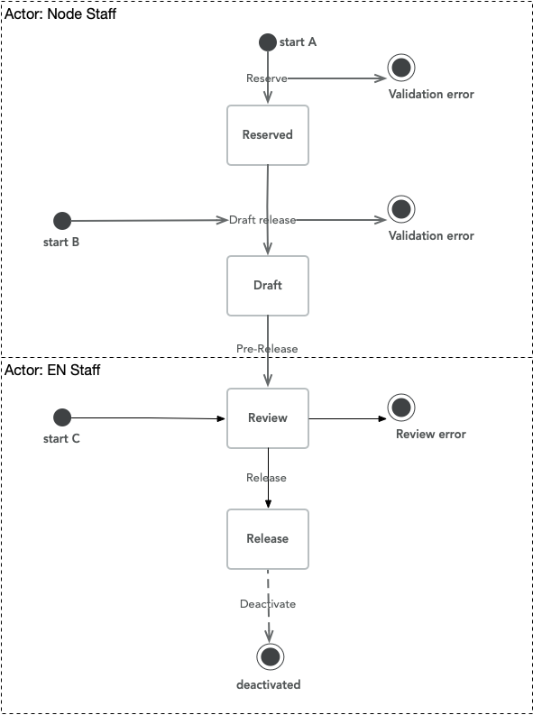
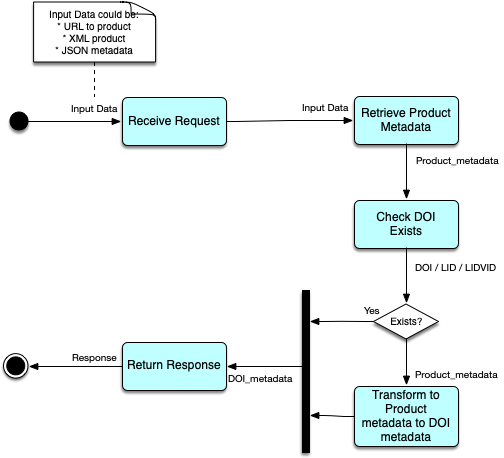
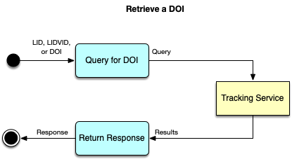

# PDS DOI Service
# Software Requirements and Design

* [Component Description](#component-description)
* [Use Cases](#use-cases)
* [Requirements](#requirements)
* [Design](#design)

## Component Description

The PDS Data Object Identifier (DOI) service is responsible for the management of [DOIs](https://www.doi.org/) for the Planetary Data System.

## Use Cases
### Generate DOI Object from PDS4 Label
1. A user posts a bundle bundle/collection/product PDS4 label to the service.
2. The service translates the metadata from the PDS4 label into the DOI/IAD Record Object
3. The service return the IAD record object

### User Submits DOI Object
1. A user posts a DOI/IAD Record object
2. The service verifies validity of the object
3. The service posts the object to the Tracking Service
   1. Alternatively, the service could post the object to a file staging area or just include in email
4. The service notifies Operator of DOI submission
   1. Alternatively, the service could send an email to Operator for manual vetting and submission.

### Operator Reserves DOI Object
1. The authenticated Operator submits a DOI object to the service for reserve DOI
2. The service validates the DOI object
3. The service submit the DOI object to the IAD Service and verifies return values
4. The service posts Reserved DOI information to Tracking Service and forwards response to Operator

### Operator Release DOI Object
1. The authenticated Operator submits a DOI object to the service for release DOI
2. The service validates the DOI object
3. The service submit the DOI object to the IAD Service and verifies return values
4. The service posts Released/Published DOI information to Tracking Service and forwards response to Operator

### Operator is alerted if a DOI is not processed nominally by the DOI provider
1. PDS EN operator receives email on DOIs which:
    - have been pending for too long (e.g. 2 days)
    - have been in a reserved or draft status without release for too long (e.g. 2 years)

2. the PDS EN operator can see a dashboard of all the DOIs with status
3. the submitter can see a summary and status of all the DOI submitted by its node.

---

## Requirements

### Level 3 Requirements
The following PDS level 3 requirements are relevant to this service:

TBD

### Level 4 Requirements

TBD

### Level 5 Requirements
The level 5 requirements in PDS are documented as github actions:
https://github.com/NASA-PDS-Incubator/pds-doi-service/issues?q=is%3Aissue+label%3Arequirement

---

## Architecture Overview

The following diagram gives a detailed view of the DOI Service within the context of the system:

The following is a more detailed breakdown of the DOI Service based on its functions:

---

## Detailed Design

### DOI Service

The DOI Service a RESTful web service that provides the ability to perform the following operations for PDS DOIs:
* Reserve a DOI
* Draft a DOI
* Release a DOI
* List and retrieve DOIs
* Update a DOI
* Deactivate a DOI

Besides a service will automatically raise alerts on DOIs which have been for too long in given status.

---

#### Basic State Diagram

---

#### Ops Workflow

---

#### Reserve a DOI

TBD
---

#### Draft a DOI

---

#### Release a DOI

TBD
---

#### List/Retrieve a DOI

For traceability purpose in respect to the OSTI system and the discipline node's submitters, full records of the transaction made are recorded. The tracked information is divided into:
- doi_transaction: one record for each operation for each DOI
- transaction: one record for each transaction (can be multiple DOIs)

Per <b>doi_transaction</b>:
For each transaction, for each doi, one record is saved with the following attributes:

| name | type | comment |
| --- | --- | --- |
| status | TEXT | current status, among: pending, draft, reserved, released, deactivated) |
| update_date* | INTEGER | as Unix Time, the number of seconds since 1970-01-01 00:00:00 UTC. |
| submitter | TEXT | email of the submitter of the DOI |
| title | TEXT | title used for the DOI |
| type | TEXT | product type |
| subtype | TEXT | subtype of the product |
| node_id | TEXT | steward discipline node ID |
| lid* | TEXT | |
| vid* | TEXT | |
| doi | TEXT | DOI provided by the provider (may be null if pending or draft) |
| release date |INTEGER | as Unix Time, the number of seconds since 1970-01-01 00:00:00 UTC.  |
| transaction_key* | TEXT | transaction (key is node id /datetime) |
| is_latest  | BOOLEAN | when the transaction is the latest |

(* composite unique key)

Only the latest record for one DOI has attribute is_latest = True. This attribute is updated at each insertion.

These records are managed in a sqllite database (https://www.sqlite.org) in a single table.

Per <b>transaction</b>:
- submitting discipline node ID
- submitting time
- submitted input
- submitted output
- comment (not managed yet)

These records are saved in a file directory structure &lt;submitting discipline node ID&gt;/&lt;transaction datetime start&gt;/ with 3 files:
- input.&lt;[xml|xlsx|csv]&gt;
- output.xml
- comment (optional)

These databases will be handled locally and later synchronized with the tracking service.

Every command line operation will interact and feed these databases locally.

Python objects are developed to handle interactions of the rest of the code with the DOI and transaction history.

The updates are logged consistently so to be re-usable in a central logging facility.
We will possibly use ELK to centralize the local logs by configuring logs and synchronization as detailed here  https://logz.io/blog/python-logs-elk-elastic-stack/

---

#### Update a DOI

See https://github.com/NASA-PDS-Incubator/pds-doi-service/issues/9 for design details

---

#### Deactivate a DOI

TBD
---

#### Alert on DOIs in certain status for too long

A command allow to extract the list of DOI with following properties:
- doi with a pending status a OSTI
- doi with a reserve status for longer than {configurable variable}
- doi with a draft status for longer than  {configurable variable}

---

### Batch Processsing Service

Batch processing service interfaces with the DOI service, and is responsible for perform DOI operations across a large number of products using a pre-defined TBD CSV format for submitting batch metadata.

The batch system will then read in this CSV, and synchronously perform DOI Service operations on the set of product metadata.

---

### DOI Command-line Client

This client will be used to access the DOI Service from the command-line. All functions available through the DOI Service should be made available from this client interface.

---

### DOI Web Interface

TBD

© 2020 California Institute of Technology.
Government sponsorship acknowledged.
